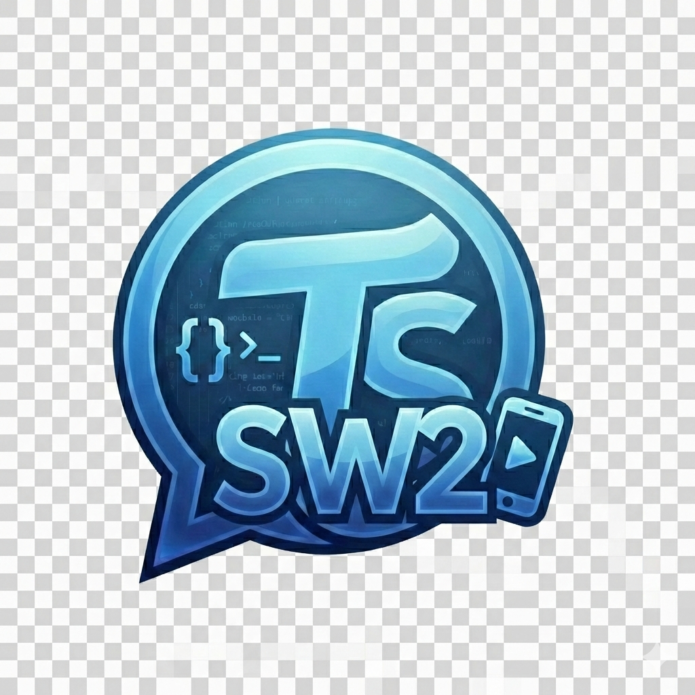

# Cursor Session Helper

  

<h3 align="center">一键提取 Cursor AI 对话记录，本地分享你的编程灵感</h3>

  
  
  
  

---

## 📖 这是什么？

在 Cursor 中使用 AI Agent 模式编程时，你和 AI 的对话包含了很多价值：

- 你的问题思路
- AI 的解决方案
- 代码优化建议
- Bug 排查过程

这些对话很有用，但 Cursor 没有方便的分享功能。

**Cursor Session Helper**解决这个问题：

- 🔍 自动提取 Cursor 数据库中的对话
- 📝 转换为清晰的 Markdown 格式
- 🌐 本地 Web 服务器一键分享，无需云端上传
- 📤 支持 Markdown / Text / JSON / HTML 四种导出格式
- 🖨️ Web 页面支持打印和下载
- 📥 支持导入外部 Markdown 会话文件
- 🗑️ Web 页面支持右键删除会话
- 📋 导出时自动生成会话概括摘要（对话轮次、涉及文件、工具使用、主题提取），支持手动编辑

---

## ⚡ 安装

### 从 VSIX 安装

1. 下载最新的 `.vsix` 文件
2. 打开 Cursor / VS Code
3. 按 `Ctrl+Shift+P` / `Cmd+Shift+P`
4. 输入 `Extensions: Install from VSIX...`
5. 选择下载的 `.vsix` 文件

**安装或更新后必做（否则页面可能仍是旧版）：**

- **重新加载窗口**：`Ctrl+Shift+P` → 输入 `Developer: Reload Window` → 回车。这样新扩展代码才会生效，本地 Web 服务才会用新版本。
- 若之前已启动过「本地服务器」，重载后请用扩展命令 **「重启本地服务器」** 或先「停止」再「启动」。
- 浏览器打开分享页时，若仍看到旧样式，请 **强制刷新**：`Ctrl+Shift+R`（Windows/Linux）或 `Cmd+Shift+R`（Mac）。

**若安装失败或页面仍旧，请排查：**

- 若曾安装过**不同 publisher/名称**的旧版，请先在扩展列表里**卸载旧扩展**，再安装本 VSIX，然后重载窗口。
- 确认 Cursor 版本满足扩展要求（见 `package.json` 中 `engines.vscode`）。

---

## 🚀 快速开始

### 1️⃣ 安装即用

安装插件后即可使用，**无需登录**。在 Cursor 左侧活动栏找到 **📚 书签图标**（Cursor Session Helper），点击打开插件面板。

> 💡 提示：可在插件设置中自定义昵称和头像

### 2️⃣ 浏览对话记录

在 **Sessions** 面板中，你可以看到所有 Cursor Composer 的对话记录：
- 按时间倒序排列
- 显示会话标题和项目名称
- 点击任意会话，在编辑器中查看 Markdown 格式的对话内容

### 3️⃣ 分享对话

想要分享某个对话？

1. 在 Sessions 列表中，右键点击要分享的对话
2. 选择"分享"
3. 在弹出的表单中确认信息（项目名称会自动填充）
4. 系统自动生成会话概括摘要（可编辑），包含对话轮次、涉及文件、工具使用统计和主题
5. 确认后，Markdown 文件保存到本地，生成本地链接
6. 打开浏览器即可查看分享内容（首页和详情页均展示摘要）

> 🔗 分享链接为本地地址 `http://localhost:8080/share/{id}`，可在同一网络内访问

### 4️⃣ 导出对话

右键点击任意对话，选择导出格式：
- **Markdown** — 适合技术文档（推荐）
- **Text** — 纯文本格式
- **JSON** — 结构化数据
- **HTML** — 可直接在浏览器中查看

---

## 🌐 本地 Web 服务器

插件内置基于 Express 的本地 Web 服务器，用于浏览和分享对话记录。

### 启动方式

| 方式 | 说明 |
| --- | --- |
| 插件面板 | 点击"基本信息"面板中的 **启动服务器** 按钮 |
| 命令面板 | `Ctrl+Shift+P` → 搜索"Cursor Session Helper"相关命令 |
| 命令行 | `npm run start:server` 独立启动 |

### 功能特性

- 📋 会话列表浏览（支持关键词搜索，分页显示每页 12 条）
- 📄 会话详情查看（Markdown 完整渲染，支持折叠和懒加载超长内容）
- 🖨️ 打印功能
- ⬇️ 下载 Markdown 文件
- 📥 导入外部 Markdown 会话文件
- 🗑️ 右键删除会话（支持确认对话框）
- 📑 左侧大纲导航（会话列表 + 消息大纲，支持拖动调整高度）
- ⬆️ 详情页"返回顶部"浮动按钮，长页面一键回到顶部
- 🛡️ 消息内容安全渲染（自动转义 `<script>`、模板字符串等危险标签）
- 🔄 服务器重启（自动杀掉占用端口的进程）和 WebUI 一键打开

### 页面介绍

#### 首页（会话列表）

访问 `http://localhost:8080` 打开首页，展示所有已分享的会话记录。

- **会话卡片**：每个会话显示标题、概括摘要（如有）、工程名称、分享人和时间，点击进入详情页
- **搜索过滤**：顶部搜索框支持按标题、项目名、分享人实时过滤
- **分页浏览**：每页显示 12 条记录（6 行 × 2 列），底部分页控件支持上一页/下一页和键盘快捷键（← →）
- **导入会话**：点击"📥 导入会话"按钮，选择 `.md` 文件即可导入外部会话
- **删除会话**：右键点击会话卡片，选择"🗑️ 删除会话"，确认后永久删除

#### 详情页（会话内容）

点击首页的会话卡片进入详情页 `http://localhost:8080/share/{uuid}`。

- **顶部信息栏**：显示会话标题、工程名称、分享人、时间、格式等元信息，以及"📋 会话概括"摘要区块（蓝色背景，如有）
- **会话指标表**：首条消息中的指标数据以表格形式展示（宽度占内容区 60%）
- **消息内容区**：
  - 用户消息（橙色边框）和 AI 回复（蓝色边框）交替展示
  - 代码块浅灰色背景渲染、表格完整渲染
  - 超长消息自动折叠，点击"▼ 展开全部"查看完整内容
  - 超大内容（>100K 字符）显示预览 + "📖 加载完整内容"按钮按需加载
- **工具栏**：右上角提供"🖨 打印"和"⬇ 下载"按钮
- **返回顶部**：页面滚动超过 300px 后，右下角出现蓝色"↑"按钮，一键平滑滚动到顶部

#### 侧边栏（大纲导航）

详情页左侧的侧边栏提供快速导航功能。

- **会话列表**：显示所有会话，红色数字标注总数，点击可快速切换到其他会话
- **消息大纲**：列出当前会话的所有消息摘要，点击可直接跳转到对应消息位置
- **拖动分隔条**：会话列表和消息大纲之间的分隔条可拖动调整高度比例，设置自动保存
- **搜索框**：支持在会话列表中快速搜索
- **折叠侧边栏**：点击"◄"按钮可折叠/展开侧边栏，留出更多内容阅读空间

### 数据存储

- 格式：Markdown 文件
- 默认目录：`~/.cursor-session-helper/shares/`
- 文件组织：按日期分目录，如 `2026-02/{uuid}.md`
- 可通过插件设置自定义存储目录

---

## ⚙️ 插件设置

| 设置项 | 说明 | 默认值 |
| --- | --- | --- |
| `cursorSessionHelper.nickname` | 自定义昵称 | 系统用户名（留空自动获取） |
| `cursorSessionHelper.avatar` | 头像（预设名称或本地图片路径） | default |
| `cursorSessionHelper.shareDirectory` | 分享存储目录 | `~/.cursor-session-helper/shares/` |
| `cursorSessionHelper.autoStartServer` | 是否随插件激活自动启动服务器 | false |
| `cursorSessionHelper.serverPort` | 本地 Web 服务器端口 | 8080 |
| `cursorSessionHelper.shareBaseUrl` | 分享链接基础 URL（可设为局域网地址） | `http://localhost:{端口}` |

---

## 💡 典型场景

**学习笔记**

你和 AI 深入讨论了某个技术问题，对话很有价值：
- ✅ 右键分享，保存到本地
- ✅ 浏览器随时回顾

**Bug 排查**

你和 AI 一起排查了 1 小时的 Bug：
- ✅ 分享对话记录
- ✅ 浏览器打开链接发给同事
- ✅ 避免其他人重复踩坑

**最佳实践**

AI 给出了很好的代码优化建议：
- ✅ 保存对话
- ✅ 整理成团队规范
- ✅ 沉淀为知识库

**会话管理**

需要清理不再需要的会话：
- ✅ 在首页右键点击会话卡片
- ✅ 选择"删除会话"
- ✅ 确认后永久删除

**导入分享**

收到同事分享的会话文件：
- ✅ 点击首页"导入会话"按钮
- ✅ 选择 `.md` 文件
- ✅ 自动解析并添加到会话列表

---

## 🔒 隐私说明

- ✅ **纯本地**：所有数据保存在本地，不上传任何云端
- ✅ **只读**：从 Cursor 本地数据库读取数据，不修改任何文件
- ✅ **用户控制**：只在你点"分享"时才保存文件
- ✅ **可编辑**：分享前可以编辑、删除敏感内容

---

## ❓ 常见问题

**Q: 为什么看不到会话列表？**

A: 请确认以下几点：
- 确保你使用过 Cursor 的 **Composer** 模式（Agent 对话）
- 插件已经成功激活（查看左侧活动栏是否有书签图标）
- 如果仍然没有，尝试重启 Cursor

**Q: Web 服务器无法启动（端口被占用）？**

A: 点击侧边栏的 **"重启服务器"** 按钮即可自动解决——它会自动检测并杀掉占用 8080 端口的进程，然后重新启动服务器。如果仍有问题：
- 查看输出面板（Output > Cursor Session Helper）的错误信息
- 尝试使用命令行 `npm run start:server` 独立启动排查问题

**Q: 支持哪些导出格式？**

A: 目前支持：
- **Markdown** — 适合技术文档，格式清晰（推荐）
- **Text** — 纯文本格式
- **JSON** — 结构化数据，便于二次处理
- **HTML** — 可直接在浏览器中查看

**Q: 如何删除不需要的会话？**

A: 在 Web 首页（`http://localhost:8080/`）：
- 右键点击要删除的会话卡片
- 选择"🗑️ 删除会话"
- 在确认对话框中点击"确认删除"
- 会话将被永久删除

**Q: 如何导入他人分享的会话？**

A: 在 Web 首页点击"📥 导入会话"按钮：
- 选择 `.md` 格式的会话文件（支持多选）
- 系统自动解析文件内容
- 导入成功后自动刷新页面

**Q: 我的数据安全吗？**

A:
- ✅ 所有数据保存在本地，不上传任何服务器
- ✅ 插件只读取 Cursor 本地数据库，不会修改任何文件
- ✅ Web 服务器仅监听 localhost，外网无法访问

---

## 📄 许可证

Apache License 2.0

---

  让每一次 AI 对话都值得分享 ✨

